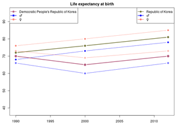

<table><tr><td>



</td><td>&nbsp;&nbsp;</td><td>

<h2>Compare the life expectancy of countries</h2>

</td></tr></table>

<p>&nbsp;</p>

The shiny webappllication I have developed is to produce a nice, simple chart of the life expectancy data taken from the WHO website. Also a datatable is provided.
<p>&nbsp;</p>

It's very simple to use: 
- follow this link to the shiny app: <a href="https://wmoco.shinyapps.io/life_expectancy">life expectancy</a>, 
- select two countries in the drop down boxes on the top left
- and admire the output. 

<p>&nbsp;</p>

So take some time now to play around with the app, then come back here and continue this presentation.

---

## Also have a look at the data

- clone my github repository `https://github.com/wmo/DDPProject`, and pull the 'slidify/countrydata.rds' into your R environment: 

```{r}
le<-readRDS("countrydata.rds")
```
- the data is pretty self explanatory, for more information have a peek at the [WHO site](http://apps.who.int/gho/data/node.main.688?lang=en)
- on the following pages there is an example of how to play around with it: how to calculate the difference in life expectation between 1990 and 2012. 

---

## Greatest change between 1990 and 2012

Create a dataframe with a column for the 1990 data, and a column for the 2012 data:
```{r}
ledif<-      merge( le[ le$year==1990, c("country","le_birth")],
                    le[ le$year==2012, c("country","le_birth")],
                    by="country")
```
Add a column that contains the difference of life-exceptancy:
```{r}
ledif$df=ledif$le_birth.y-ledif$le_birth.x
head(ledif,3)
```
--- 

Countries with the greatest negative change :
```{r}
head( ledif[order(ledif$df),c(1,4)],3)
```

Countries with the greatest positive change :
```{r}
head( ledif[order(-ledif$df),c(1,4)],3)
```

--- 

## Credits 

- Thanks for your time! 

- Credit goes to the World Health Organization, for being allowed to use their data. 

- And of course credit also due to Rstudio / Shiny and Slidify and the JHU datascience team! 

